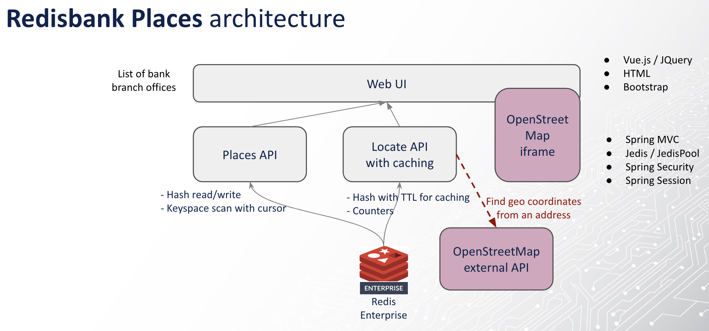
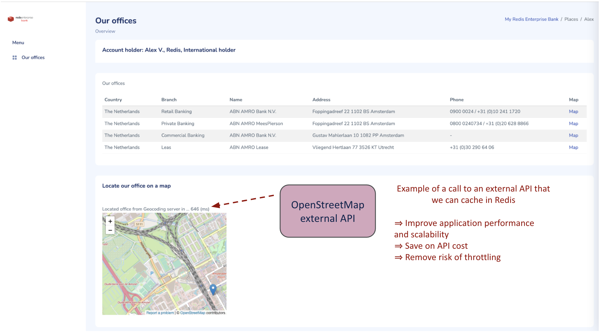

# Exercise 6 - Redis caching use case with Java/Jedis: Redisbank Places

In this exercise we will meet 'the other Redis client' for Java: [Jedis](https://www.baeldung.com/jedis-java-redis-client-library), and use it to cache data retrieved from an external API for ultra fast lookups.

This application uses **Redis Stack** with Redis core data structures (Hashes, Time to live expiry, Hashes scans) to build a
Java/Spring Boot/Jedis application that loads a list of banking office addresses and uses a slow external API for geocoding
purpose and display the office location on a map. 
The 3rd party service is slow and might be rate limited or paid-for so is a scenario for using Redis as a cache to keep the geocoding information. 
UI in Bootstrap/CSS/Vue.

Features in **Redisbank Places**:

- **Jedis** for simple Java API for Redis with pool support
- **Redis Hashes** for simple object / key-value mapping and read/write/scans in Redis
- **Redis TTL** for time to live expiry on any Redis key
- **Redis counter** for atomic counter increments

> - The application is using the Spring framework in a very basic way only for the web/REST API and for running as standalone executable jar
> - The codebase is using plain Jedis API for Redis.

# Architecture

Let's get started!

## Running the code

Assuming you still have Redis running in GitPod, all we have to do is compile the app and run it.

From the *exercise6-start* folder in the terminal window:

- `./mvnw -f pom.xml clean package` to build the code
- `java -jar target/redisbankplaces-0.0.1-SNAPSHOT.jar --spring.profiles.active=prod` to run the app

This app hosts a website at port 8080. Try to connect to it. What do you see?

## Tasks

The application presents a list of branch offices of a bank - served from Redis. Each office can also be presented on a map to get an easy overview of how to visit them.

The map uses geo locations (longitude and latitude), which are dynamically retrieved from the OpenStreetMapAPI.

Hitting a slow back-end system such as an external API has impacts on latency, so the page is slow in presenting the map.

1. Somehow the caching of the geolocations isn't working. Make sure after every lookup of the location, the result is cached for 1 minute.
What is the typical speedup you get in the lookup?
2. *(Optional)* The branch office places are populated by the /api/places endpoint. The data is returned by a SCAN over the Places keyspace in Redis. Refactor this to use RediSearch instead, and query for Amsterdam offices. 

## Tips

You will find a complete working application including all the steps above in the *exercise6-solution* folder. However, try not to look at the solution before you tried to get it working yourselves.

## Next steps

Nice! By now you experienced and got a taste of both Java clients, and will probably have a favorite already. 

After seeing Redis in action in this 'simple' caching use case, we'll next see Redis in full glory as the real-time database it is in our final [exercise](exercise-7-start.md). 
