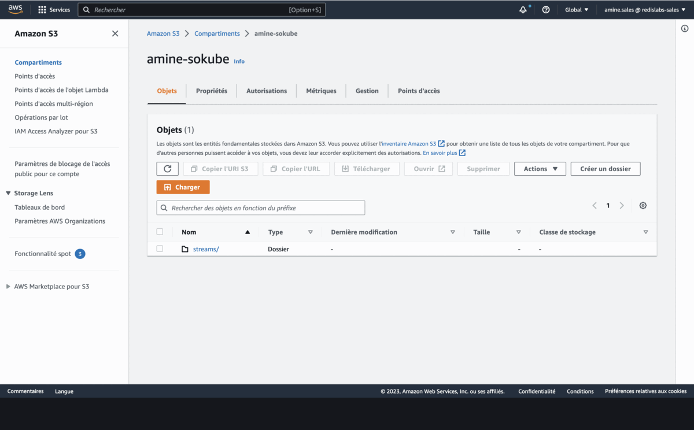

# Exercise 6 - Persist Redis Streams to AWS S3

In this exercise we will persist our working Redis database into a specific S3 bucket in AWS. Then we will create another database from this backup. For this exeercice, you need an AWS account with working Access key ID	and Secret access key.

1. Create an S3 bucket
2. In the Redis Enterprise console, go to databases and select the sourceDB. In the configuration tab, click on export.
3. A prompt is opened. Choose AWS S3, then fill the path where you want to export the backup, and the AWS credentials.
4. As soon as you validate this step, a backup file (\*.rdb.gz) will be created in your S3 backet.
5. Now you can create another database, called targetDB
6. In the configuration tab, click on import
7. A prompt is opened. Choose AWS S3, then fill the path(s) from where you want to import the backup, and the AWS credentials.
8. As soon as you validate this step, the target database is now identical to the source database. We have now our streams in another database.

## Next steps

Congrats! You made it to the end of our workshop.
By now you should have a solid overview of Redis Streams, ways to interact (CLI, GUI, and client options).
