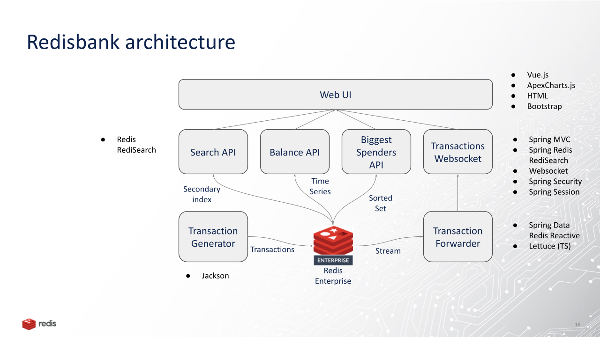

# Exercise 7 - real-time data in action in a complete app: RedisBank

This application uses **Redis Stack** combining Redis core data structures, Streams, RediSearch and TimeSeries to build a
Java/Spring Boot/Lettuce application that shows a searchable transaction overview with realtime updates
as well as a personal finance management overview with realtime balance and biggest spenders updates. UI in Bootstrap/CSS/Vue.

Features in **Redisbank**:

- **Redis Streams** for the realtime transactions
- **RedisJSON** for storing transactions
- **Redis Sorted Sets** for the 'biggest spenders'
- **RediSearch** for searching transactions
- **Redis TimeSeries** for the balance over time
- **Redis hashes** for http session storage via Spring Session

# Important note

In this workshop version of the code:

> - The application is using the Spring framework in a very basic way only for the web/REST API and for running as standalone executable jar
> - The codebase is using plain Lettuce API for Redis.
> - The data model for BankTransaction is JSON with RedisJSON (instead of basic Redis Hashes)
(You may want to check the more complex version of the application in the upstream if you are familiar with Spring Data and Spring Data Repository)

# Architecture

## Running the code

Assuming you still have Redis running in GitPod, all we have to do is compile the app and run it.

From the *exercise7-start* folder in the terminal window:

- `./mvnw spring-boot:run` to build and run the app

This app hosts a website at port 8080. Try to connect to it, and pass the login page with user `lars` and password `larsje`

## Tasks

## Tips

You will find a complete working application including all the steps above in the *exercise7-solution* folder. However, try not to look at the solution before you tried to get it working yourselves.

# Interesting code to explore

- [BankTransaction](https://github.com/ruurdk/redisbank/blob/basic/src/main/java/com/redislabs/demos/redisbank/transactions/BankTransaction.java) is a plain POJO
- Stored in Redis using RedisJSON Lettuce [redis.jsonSet](https://github.com/ruurdk/redisbank/blob/442905b1c47bf045a12f288d4af932740e5a0b51/src/main/java/com/redislabs/demos/redisbank/transactions/BankTransactionForwarder.java#L65)  
- With an index in RediSearch [BankTransactionGenerator](https://github.com/ruurdk/redisbank/blob/442905b1c47bf045a12f288d4af932740e5a0b51/src/main/java/com/redislabs/demos/redisbank/transactions/BankTransactionGenerator.java#L87)
- and with RediSearch query thru a REST/JSON api [TransactionOverviewController](https://github.com/ruurdk/redisbank/blob/442905b1c47bf045a12f288d4af932740e5a0b51/src/main/java/com/redislabs/demos/redisbank/transactions/TransactionOverviewController.java#L99)

and also
- biggest spenders categories using Redis sorted set [redis.incrementScore](https://github.com/ruurdk/redisbank/blob/442905b1c47bf045a12f288d4af932740e5a0b51/src/main/java/com/redislabs/demos/redisbank/transactions/BankTransactionGenerator.java#L162)
- accessed using a Redis sorted set range [redis.rangeByScoreWithScores](https://github.com/ruurdk/redisbank/blob/442905b1c47bf045a12f288d4af932740e5a0b51/src/main/java/com/redislabs/demos/redisbank/transactions/TransactionOverviewController.java#L81)

## Next steps

Congrats! You made it to the end of our workshop.

By now you should have a solid overview of Redis data types, ways to interact (CLI, GUI, Java and client options). 

On top of that we also explored some use cases ranging from Redis as a cache to a modern real-time database.